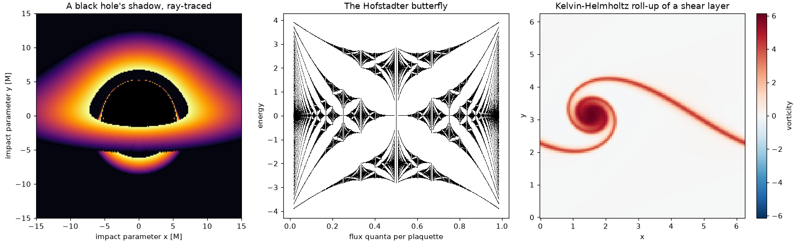

physicskit
==========

.. include:: /_generated/vars.rst

**physicskit** is a unified scientific toolkit for computational physics,
spanning |num_subpackages| domains -- from stellar dynamics to quantum
entanglement -- under one NumPy-based API. It's built for physics students
working through a textbook problem, curious learners exploring a topic
on their own, and educators building a demonstration: every subpackage
is called, tested, and visualized the same way, so moving from classical
mechanics to condensed matter to general relativity means picking up new
physics, not a new set of conventions. Units stay native to the field
instead:
:math:`G=1` for orbits, :math:`\hbar=1` for quantum states, :math:`k_B=1`
for statistical mechanics, matching how the papers you're checking against
actually write it, rather than forcing everything through SI.
:doc:`Units and conventions </tutorials/units_and_conventions>` lists each
subpackage's convention and shows how :mod:`physicskit.units` converts
results to SI once you choose the physical scale.

Every subpackage is grounded in the physics it implements, not just coded
against it: public functions carry runnable, CI-checked examples, and each
subpackage's :doc:`history </history/index>` page traces the breakthroughs
behind it -- from Huygens' 1690 wave construction to the 2017 GW170817
neutron-star chirp -- each one linked to the code that reproduces it. The
goal is a toolkit you can trust to move between domains without
re-deriving the plumbing every time:

- :mod:`physicskit.astro` -- stellar structure, N-body dynamics, orbital mechanics, galactic dynamics

  .. image:: _static/images/readme_astro.png
     :alt: The figure-eight three-body choreography, Lane-Emden polytropes, and a flat galactic rotation curve
     :width: 100%

- :mod:`physicskit.chaos` -- chaotic dynamical systems and 2D quantum billiards

  .. image:: _static/images/readme_chaos.png
     :alt: A chaotic trajectory in the Bunimovich stadium, the Lorenz attractor, and the standard map
     :width: 100%

- :mod:`physicskit.classical` -- classical (Newtonian/Lagrangian/Hamiltonian) mechanics

  .. image:: _static/images/readme_classical.png
     :alt: The FPUT recurrence, a Hénon-Heiles Poincaré section, and the Dzhanibekov effect
     :width: 100%

- :mod:`physicskit.condensed` -- tight-binding models, topological band theory, superconductivity

  .. image:: _static/images/readme_condensed.png
     :alt: The Hofstadter butterfly, Haldane ribbon edge states, and SSH zero modes
     :width: 100%

- :mod:`physicskit.fields` -- electrodynamics (FDTD), solitons, BEC vortex lattices

  .. image:: _static/images/readme_fields.png
     :alt: KdV soliton fission, FDTD dipole radiation, and a BEC vortex-antivortex pair
     :width: 100%

- :mod:`physicskit.fluids` -- potential flow, viscous flow, vortex dynamics, instabilities, compressible flow, Navier-Stokes

  .. image:: _static/images/readme_fluids.png
     :alt: Kelvin-Helmholtz roll-up, a von Kármán vortex street, and flow past a spinning cylinder
     :width: 100%

- :mod:`physicskit.optics` -- ray/wave/Gaussian-beam optics, Wigner functions, Jaynes-Cummings dynamics

  .. image:: _static/images/readme_optics.png
     :alt: Young's double-slit fringes, a Laguerre-Gauss vortex beam, and the Wigner function of a Fock state
     :width: 100%

- :mod:`physicskit.particle` -- relativistic kinematics, two-body decays, scattering, nuclear physics

  .. image:: _static/images/readme_particle.png
     :alt: A Higgs diphoton bump, the semi-empirical mass formula, and the Rutherford cross section
     :width: 100%

- :mod:`physicskit.plasma` -- single-particle motion, magnetohydrodynamics, cold-plasma waves, kinetic theory

  .. image:: _static/images/readme_plasma.png
     :alt: The two-stream instability's phase-space vortex, Grad-Shafranov flux surfaces, and a magnetic-mirror orbit
     :width: 100%

- :mod:`physicskit.quantum` -- quantum mechanics: wave packets, potentials, entanglement

  .. image:: _static/images/readme_quantum.png
     :alt: A wave packet through a double slit, barrier transmission resonances, and hydrogen radial densities
     :width: 100%

- :mod:`physicskit.relativity` -- numerical general relativity: black holes, lensing, gravitational waves

  .. image:: _static/images/readme_relativity.png
     :alt: Light bending around a black hole, a ray-traced shadow, and the GW150914 chirp
     :width: 100%

- :mod:`physicskit.rmt` -- random matrix theory, organized around Dyson's threefold way

  .. image:: _static/images/readme_rmt.png
     :alt: Wigner's semicircle law, level-spacing distributions for the three ensembles, and Ginibre's circular law
     :width: 100%

- :mod:`physicskit.semiclassical` -- WKB/EBK quantization, semiclassical propagators, the Gutzwiller trace formula, and quantum scarring

  .. image:: _static/images/readme_semiclassical.png
     :alt: A quantum scar in the stadium, the Gutzwiller trace formula, and a Feynman phasor spiral
     :width: 100%

- :mod:`physicskit.statphys` -- statistical mechanics: lattice models, molecular dynamics, criticality

  .. image:: _static/images/readme_statphys.png
     :alt: The 2D Ising model at criticality, percolation clusters, and Lee-Yang zeros
     :width: 100%

.. important::

   Each domain is a teaching-depth subset of its field, not a complete
   implementation. physicskit is not a replacement for specialist
   libraries in production work: for that, use the dedicated tools
   (`SciPy <https://scipy.org/>`__,
   `QuTiP <https://qutip.org/>`__,
   `Astropy <https://www.astropy.org/>`__,
   `REBOUND <https://rebound.readthedocs.io/>`__,
   `Kwant <https://kwant-project.org/>`__,
   `PlasmaPy <https://www.plasmapy.org/>`__,
   and the like) directly.

**physicskit** is part of a family of packages -- **physicskit**,
`mathematicskit <https://cpoli.github.io/mathematicskit/>`_ and
`chemistrykit <https://cpoli.github.io/chemistrykit/>`_ -- that share the
same architecture, API conventions, and history-driven documentation.
For tight-binding models beyond :mod:`physicskit.condensed` -- arbitrary
finite lattices, ribbons and defects, non-Hermitian bands, Landauer
transport, and the kernel polynomial method for very large samples --
see the dedicated package `tbkit <https://cpoli.github.io/tbkit/>`_.

Conventionally imported as ``pk``:

.. code-block:: python

   import physicskit as pk
   import numpy as np

   H = lambda k1, k2: pk.condensed.haldane_model(k1, k2, phi=np.pi / 2)
   chern_numbers = pk.condensed.compute_chern_number(H, grid_size=30)
   print(chern_numbers)  # [1, -1]

.. toctree::
   :maxdepth: 2
   :caption: Subpackages
   :hidden:

   subpackages/index

.. toctree::
   :maxdepth: 2
   :caption: History
   :hidden:

   history/index

.. toctree::
   :maxdepth: 2
   :caption: Tutorials
   :hidden:

   tutorials/index

.. toctree::
   :maxdepth: 2
   :caption: Examples
   :hidden:

   examples/index

.. toctree::
   :maxdepth: 2
   :caption: API
   :hidden:

   api/index

